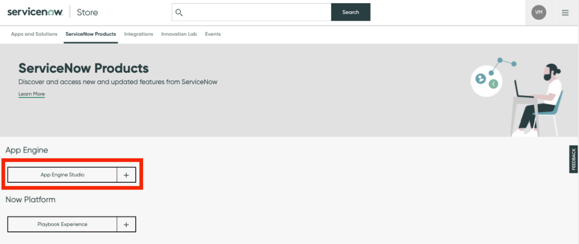

{: .d-inline-block }
# Install Requirements
{: .d-inline-block }
Published 3/13/2023
{: .label .label-green }

[Previous][PREV]{: .btn .mr-2 .fs-2}
[Next][NEXT]{: .btn .btn-purple .fs-2}

{: .highlight}
> This part of the lab is for information purposes only. 
>
> No activity required.

{: .important}
> Before installing App Engine Studio, review all platform requirements and define an organizational instance strategy to prepare for successful installation and configuration.

# Table of contents
{: .no_toc .text-delta }

1. TOC
{:toc}

# Platform requirements

{: .highlight}
> This section is for reference only. No activity required. 
 
## - App Engine license
Contact your ServiceNow Account Manager for additional information on App Engine, or see [ServiceNow App Engine](https://www.servicenow.com/products/now-platform-app-engine.html)

## - **admin** role
**admin** role is required in all instances to install App Engine applications from the ServiceNow Store.

# Define instance strategy

{: .highlight}
> This section is for reference only. No activity required. 

When defining the instance strategy for App Engine Studio, it is recommended to leverage one production instance and at least two sub-production instances – however App Engine Studio can support any number of sub-production instances as part of an instance strategy.

Applications are deployed to the production instance once developed and successfully tested in sub-production instances. One sub-production instance will serve as the development environment, and the other as the test environment.

If your organization uses sandbox or staging environments in addition to test and development, they can be incorporated to the instance strategy accordingly based on organizational needs.

*Example instance strategy with one production instance and three sub-production instances*

Sub-production instances that are most similarly configured to your production instance are the best candidates for test and stage environments. This way, administrators can more accurately find issues that may arise if the application is deployed to production.

{: .note}
For more information, see [[Product Documentation: Instance strategy for App Engine Studio]](https://docs.servicenow.com/csh?topicname=aes-instance-strategy.html)

# Opt-in and manage entitlements

{: .highlight}
> This section is for reference only. No activity required. 

Before installing the application from the ServiceNow Store, verify the instance has valid ServiceNow entitlements.

In the ServiceNow Store, use the search criteria to find App Engine Studio.

 
Click **Opt-in** and agree to the ServiceNow terms and conditions to verify entitlements.

Click **Manage Entitlements** and set the 'Entitlement Type' value to **Entitle all Instances** (*if you prefer to manually select which instances which will be affected, select Entitle Selected Instances).*

# Install App Engine applications

{: .highlight}
> This section is for reference only. No activity required. 

To install the App Engine Studio application (***com.snc.app-engine-studio***), login to your **development** instance and navigate to "System Applications" >> "All Available Applications" >> "All"

Use the search criteria to find the App Engine Studio application. Click **Install / Update All**.

The App Engine Studio bundle will be installed in the development instance-- including the App Engine Studio application and all dependent applications.

---

To install the App Engine Management Center application (***sn_aemc***), login to your **production** instance and navigate to "System Applications" >> "All Available Applications" >> "**All**"

Use the search criteria to find the App Engine Management Center application. Click **Install / Update All**.

Repeat this process on all instances for cloning purposes.

{: .note}
> For more information, see:
> 
> -   [*[ServiceNow Store: Install a ServiceNow Product]*](https://store.servicenow.com/%24appstore.do%23!/store/help?article=KB0030186)
> 
> -   [*[Product Documentation: Install App Engine Studio]*](https://docs.servicenow.com/csh?topicname=install-aes.html)
> 

# Install 'Deployment Pipeline' plugin in each instance

{: .highlight}
> This section is for reference only. No activity required. 

To install the Deployment Pipeline plugin, (***com.snc.deployment-pipeline***), login to any instance and navigate to **System Definition \Plugins.**

Use the search criteria to find the application. Click **Install**.

Repeat and install the Deployment Pipeline plugin in each sub-production instance.

[Previous][PREV]{: .btn .mr-2 .fs-2}
[Next][NEXT]{: .btn .btn-purple .fs-2}

[PREV]: /lab_aemc/docs/personas-and-roles
[NEXT]: /lab_aemc/docs/configure-aes