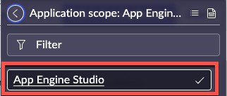
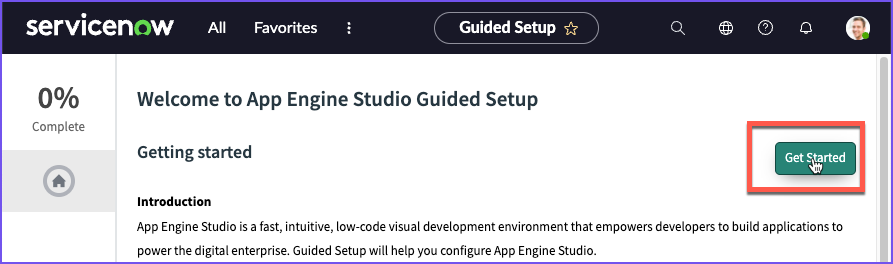

# Configure App Engine Studio

{: .d-inline-block }
Published 3/10/23
{: .label .label-green }

*In this lab, we will review and update App Engine Studio developer access to builder tools during development.*

{: .important}
> App Engine Studio is configured in the **Dev** environment where development ent will occur. 

---

| 1) Log in to your **Dev** Lab instance. 

{: .warning}
> | *Be sure your application scope is set to **App Engine Studio**. If it is not, use the application picker to change the current session's scope.*  |  |

| 2) Click **All**|  | 
| 3) Type **App Engine** 
| 4) Look for **Configuration** -> "**Guided Setup**.  
| 5) Click on **Guided Setup**.  
| 6) Click on "**Get** **Started**" |  |
| 7) Click on **Get Started** in the **Review and setup tooling** section |  |
| 8) Click on **Skip** in the **Connect Spokes** Section |  |

{: .note}
*We are skipping **Connect Spokes** for this lab. In that section, you would configure credentials to different services to that they can be leveraged by App Engine Users building applications.*

| 9) Click **Configure** in the **Review Flow Designer access settings** section. |  |

{: .note-title }
> Things to consider
>
> *Here you would want to review and update App Engine Studio developer access settings to Flow Designer Resources and update as necessary.*
> 
> *Developers can leverage Flow Designer capabilities while creating logic and automation for custom applications.*
> 
> *Consider restricting developer access to Flow Designer Resources using content filtering for Flow Designer. This allows administrators to manage access to Flow Designer resources and specify which features App Engine Studio users can leverage while building applications.*

| 10) Review the **Flow Designer access settings** |  |
| 11) When you are done reviewing the Flow Designer access settings, close out the modal. | |

{: .note}
> *For the purposes of this lab, we are only reviewing where to manage the Flow Designer access settings.*
>
> *It is recommended to implement a strategy that works best for your instances.*

{: .highlight}
> For more information on Flow Designer resources, see
>
> [Product Documentation: Content Filtering for Flow Designer](https://docs.servicenow.com/csh?topicname=content-filtering-flow-designer.html)

| 12) Click **Mark as Complete**. |  |
| *Notice that the % Complete has increased on the page.*  |  
| 13) In the section **Review Service Catalog access settings**, click on **Configure** |  |

{: .note}
> *Review App Engine Studio developer access to the Catalog Builder tool’s catalog item templates and catalogs / categories.*
> 
> *By default, App Engine Studio developers can leverage catalog templates to quickly create record producers or catalog items. Developers can also publish catalog items to any catalog. 

> If you wish to limit access to templates or restrict publishing access to catalogs or categories, update the access accordingly in Catalog Builder.*
>
> *Think about what settings you might adjust in your environment.*
>

{: .highlight}
> For more information on managing the Catalog Builder, see 
>
> [Product Documentation: Set up the catalog builder](https://docs.servicenow.com/csh?topicname=set-up-cat-builder.html&version=latest)

| 14) Click **Mark as Complete** on the **Review Service Catalog access settings** section |  
| 15) Click **Configure** in the section **Set up an instance scan cadence in Health Center** |  
| *Explore some of the Instance Scan definitions.* |  
| 16) When you are done exploring, click **X** to close the modal |  

{: .note}
> *For the purposes of this lab, we are only reviewing where to manage the Instance Scan definitions.*
>
> *Work with your Platform Adminstrator on an overall Instance Scan strategy for Subproduction environments.*

| 17) Click **Mark as Complete** on the **Set up an instance scan cadence in Health Center** |  |

{: .note}
> *Deploy custom applications with confidence by setting up Instance Scan definitions to monitor instance health throughout the deployment process. Instance scans interrogate your instance for configurations and health issues, allowing administrators an opportunity to address best practices and to avoid similar configuration issues in the future.*
> 
> *Instance Scan definitions are executed automatically when App Engine Studio applications are promoted to the **Testing** instance. Instance Scan results will be logged in the Notes section of the Deployment Request record.*
> 
> *The App Engine Studio application does not ship with any out-of-box Instance Scan definitions (however a few Instance Scan definitions are installed with the Deployment Pipeline plugin to run basic performance checks).*
> 
> 
> *Work with professional ServiceNow developers to configure Instance Scan definitions and enforce best practices in your environments.*

{: .highlight}
> *For more information on managing instance health scans, see 
> [Product Documentation: Instance Scan](https://docs.servicenow.com/csh?topicname=hs-landing-page.html)*

| 18) Click the gray circle on the left hand side of the page below the green check mark. It should say **Set up user access** when you hover over it.  |  |
| 19) Click **Get Started** in the **Set up user access** section |  |

{: .note}
> *Configure App Engine Studio administrator group membership in the **development** instance to manage development activities that occur in the development environment.*
> 
> *While development activities will be managed in the **development** instance, administrators manage application intake, collaboration, and deployment requests in **production**.*
> 
> *Group membership does not sync across instances, therefore App Engine Studio administrator group membership will also need to be provisioned in the [production] instance as part of the Pipelines and Deployment or Application Intake Guided Setup activities*

| 20) Click **Configure** in the **Set up admin group** section |  |
| 21) Click **Edit...** on the **Group Members** tab |  |
| 22) Move **Jayne Nigel** to the right hand side and click Save like in the image below. |  |

{: .important}
> Jayne will play the part of our App Engine Admin later in the lab.

| 23) Click the "Group = App Engine Admins" filter on the **Group Members (1)** related list to refresh the list.  |  |
| *You should see **Jayne Nigel** appear in the **User** column after a few seconds.*  |
| 24) After that click the "X" in the top right corner to close the modal.  | 
| 25) Next to **Set up admin group** click "Mark as Complete" then next to **Grant access to your current developers** click "Mark as Complete". |  | 

{: .highlight}
> We are skipping **Grant access to your current developers** for this lab. 
>
> This is for configuring Developers in Dev that have pre-existing permissions. 
>

| 26) Click **Configure** next to **Grant access to other users** |  |
| 27) Click **Edit** on the **Group Members** related list. |   |
| 28) Move **Abel Tuter** to the right hand side and click **Save**.  | 

{: .highlight}
*The purpose of this step is that by adding Abel to the group "App Engine Studio Users" his membership in the group he will be granted the role **sn_app_eng_studio.user** will which allow him to access App Engine Studio.*

| 29) Click the **X** in the top right of the modal to close it. |  
| 30) Next to **Grant access to other users** click **Mark as Complete**. | 

**Congratulations!  App Engine Studio is ready to go in your Dev environment!**

[Previous][PREVIOUS]{: .btn .mr-4 }
[Next][NEXT]{: .btn .btn-purple }

[PREVIOUS]: /lab_aemc/docs/install-reqs
[NEXT]: /lab_aemc/docs/credentials