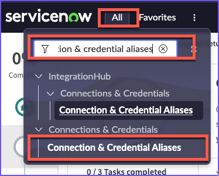
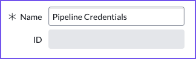
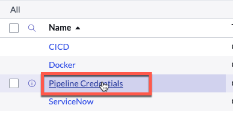
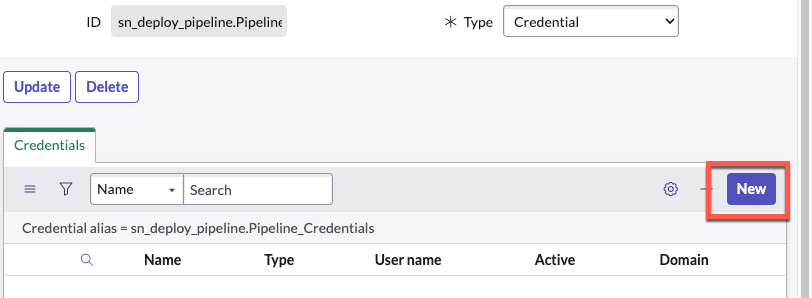

{: .d-inline-block }
# Configure Credentials
{: .d-inline-block }
Published 3/10/2023
{: .label .label-green }

[Previous][PREV]{: .btn .mr-2 .fs-2}
[Next][NEXT]{: .btn .btn-purple .fs-2}

{: .important}
> Complete the steps below in all of your Lab environments.  
>
> Start with Prod, then Test, then Dev.

*Credentials allow App Engine Studio and App Engine Management Center to communicate.*

| 1) Navigate to **All** 
| 2) Type **Connections & Credentials** 
| 3) Click on **Connection & Credential Aliases** | 
| 4) Click the purple **New** button in the top-right to create a new Credential Alias record. | 
| 5) Set the **Type** to **Credential**. |  |
| 6) Set the **Name** to `Pipeline Credentials` and click **Submit** | 
| 7) Click **Pipeline Credentials** to open the record. | |
| 8) Navigate to the **Credentials** Related List and click **New** to add a credential. ||
| 9) Select **Basic Auth Credentials**  ||
| 10) On the **Basic Auth Credentials** form, fill in these values and click **Submit**. 

| Field | Value 
|:---|:---
| Name | Pipeline Service Account 
| Username | pipeline_user
| Password | LabTime4Me!

|

{: .warning}
> Remember to complete the steps above in all of your Lab environments before continuing to the next exercise. 
>

[Previous][PREV]{: .btn .mr-2 .fs-2}
[Next][NEXT]{: .btn .btn-purple .fs-2}

---
# Additional Notes 

{: .important}
Only users assigned the **admin** role can create and update Credential Alias records.

{: .note}
> ***Based on the credential information, take the appropriate approach in configuring Credential Alias records:***
> 
> *If all environments in the Deployment Pipeline will use the **same** credential information (same username/password), then only **one** Credential Alias record will be configured in production*
> 
> *- i.e., single Credential Alias record named '*Pipeline Credentials'*
>
> *However, if each environment in the Deployment Pipeline will use different credentials (different usernames / passwords), then Credential Alias records will be created for each instance in the production instance*
> 
> *- i.e., multiple Credential Alias records named 'Dev Credentials', 'Test Credentials', 'Stage Credentials', and 'Prod Credentials'*

{: .note}
> For your Pipeline Credentials, it is recommended to use a dedicated service account so that the password does not expire or change. 
>
> The service account **must exist** in the target instance(s) and have admin permissions.
>

{: .note}
*Currently, **Basic Auth** is the only Credential type supported by App Engine Studio*

{: .note}
> *Set up and configure the environments that will be included within your pipelines. These will be referenced when building your pipelines.*
> 
> *Your production instance is where your pipeline configurations reside and will be your controller instance.*
> 
> *The 'Is Controller?' box will be **checked** on your production instance only. This box will be **unchecked** for all sub-production Environment records.*
>
> *If you have **more than one** Production environment, then AEMC will only be the controller on a single instance for all of your other Prods.*

{: .note}
*For more information, see [[Product Documentation: Create a Connection & Credential Alias]](https://docs.servicenow.com/csh?topicname=connection-alias.html)*

---

[Previous][PREV]{: .btn .mr-2 .fs-2}
[Next][NEXT]{: .btn .btn-purple .fs-2}

[PREV]: /lab_aemc/docs/configure-aes
[NEXT]: /lab_aemc/docs/pipelines-deployments