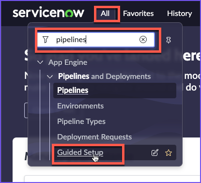
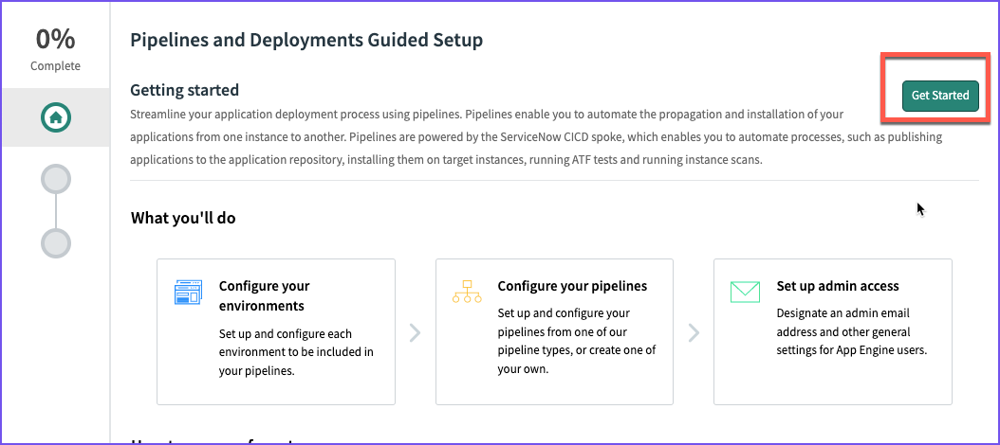
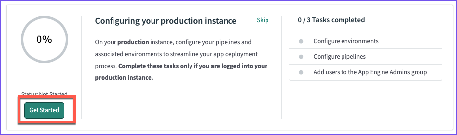
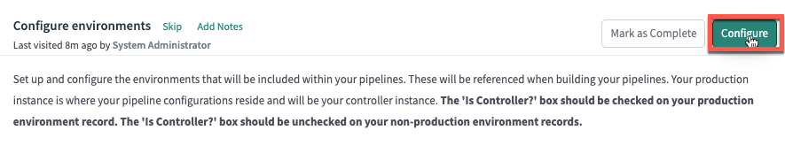
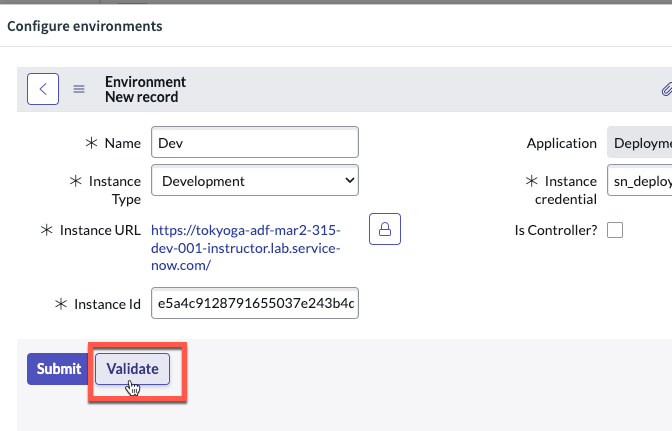
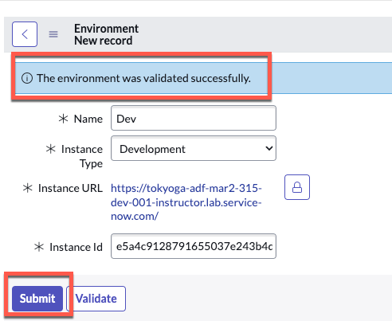

# Configure Environments
{: .d-inline-block }
IN PROGRESS
{: .label .label-yellow }


{: .warning}
The next section is to be completed in your **production** instance where AEMC is installed.

| 1) Click **All** | 
| 2) Type **pipelines**  
| 3) Click **Guided Setup** in the Pipelines and Deployments section 
| 4) Click the green **Get Started** button in the top-right. | 
| 5) Click **Get Started** in the **Configuring your production instance** section | 
| 6) Click **Configure** in the **Configure Environments** section  | 
| 7) Click **New** in the top right | 
| 8) Complete the form as below.  You **will not** be able to Submit until we get the Instance Id in the following steps. |  |

| Field | Value |
|:---|:---|
| Name | ```Dev``` |
| Instance Type| ```Development``` |
| Instance URL | ```The full URL of your Dev Lab instance (Ex. https://your-lab-123.service-now.com)``` |
| Instance credential | ```sn_deploy_pipeline.Pipeline_Credentials``` |
| Is Controller? | ```Leave unchecked``` |
| Instance Id | ```*See instructions below*``` |

{: .important}
*For the field "**Instance Id**", we will need to log in to the Dev Lab instance and manually retrieve this value.*

{: .warning}
***Switch to your Dev instance for these next few steps***

**On your Dev instance**

| 9) Click **All** 
| 10) Type ```stats.do```
| 11) Hit Enter
| 12) Select and copy the value for *Instance ID* | 

{: .warning}
***Switch back to your Production instance***

| 13) Paste the *Instance ID* value into the *Instance ID* field and click **Validate**. | |

|

| You should see a blue message that says "*The environment was validated successfully*". |

{: .warning}
> *If you see a red error message*
> 
>
> *Then you will need to do the following:*
> - Log in to Dev
> - Set the password for **pipeline_user**
> - Log in to Prod
> - Update the Credential records for **pipeline_user**
> - Attempt Validation again

[Previous][PREVIOUS]{: .btn .mr-4 }
[Next][NEXT]{: .btn .btn-purple }

--- 
# Additional Notes

{: .note}
*For more information about Environments, see [[Product Documentation: Define environments]](https://docs.servicenow.com/csh?topicname=create-environment.html)*

[PREVIOUS]: ../150_Credentials
[NEXT]: ../170_Pipeline