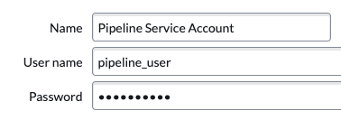

# Configure - Pipeline and Deployment
{: .d-inline-block }
WORK IN PROGRESS
{: .label .label-yellow }

---

{: .important}
> *Before beginning Pipelines and Deployment Setup, ensure your application scope is set to '**Deployment Pipeline**'.* | 

*Pipelines enable you to automate the propagation and installation of your applications from one instance to another. Pipelines are powered by the [ServiceNow CI / CD spoke](https://docs.servicenow.com/csh?topicname=cicd-spoke-1.html&version=latest), which enables you to automate processes such as publishing applications to the [application repository](https://docs.servicenow.com/csh?topicname=app-repo.html&version=latest), installing them on target instances, and running [ATF tests](https://docs.servicenow.com/csh?topicname=automated-test-framework.html&version=latest) and/or [instance scans](https://docs.servicenow.com/csh?topicname=hs-landing-page.html&version=latest).*

*Pipeline and Deployment Guided Setup activities do not sync across instances and Pipeline configuration activities are required on all instances (production and sub-production).*

---

{: .warning}
Complete the next section only if you are logged into your **production** instance.

*In the **production** instance, complete the following steps to configure environments and deployment pipelines to streamline your application deployment process*.

## Install 'Deployment Pipeline' plugin in production 

{: .highlight}
> This has already been installed for you on the Lab instance. 
>
> For future reference, the name of the Deployment Pipeline plugin is ```com.snc.deployment-pipeline```

## Configure credentials in production 

Credentials allow your production instance to communicate with sub-production instances.

{: .important}
Only users assigned the **admin** role can create and update Credential Alias records.

| 1) Navigate to **All** 
| 2) Type **Connections & Credentials** 
| 3) Click on **Connection & Credential Aliases** | 
| 4) Click the purple **New** button in the top-right to create a new Credential Alias record. | 
| 5) Set the **Type** to **Credential**. |  |
| 6) Set the **Name** to `Pipeline Credentials` and click **Submit** | 


{: .note}
> ***Based on the credential information, take the appropriate approach in configuring Credential Alias records:***
> 
> *If all environments in the Deployment Pipeline will use the **same** credential information (same username/password), then only **one** Credential Alias record will be configured in production*
> 
> *- i.e., single Credential Alias record named '*Pipeline Credentials'*
>
> *However, if each environment in the Deployment Pipeline will use different credentials (different usernames / passwords), then Credential Alias records will be created for each instance in the production instance*
> 
> *- i.e., multiple Credential Alias records named 'Dev Credentials', 'Test Credentials', 'Stage Credentials', and 'Prod Credentials'*

{: .highlight}
For this lab, we will create a single credential for all environments. 

| 7) Click **Pipeline Credentials** to open the record. | |
| 8) Navigate to the **Credentials** Related List and click **New** to add a credential. ||
| 9) Select **Basic Auth Credentials**  ||

{: .highlight}
*Currently, **Basic Auth** is the only Credential type supported by App Engine Studio*

{: .note}
> For your Pipeline Credentials, it is recommended to use a dedicated service account so that the password does not expire or change. 
>
> The service account **must exist** in the target instance(s) and have admin permissions.
>

| 10) On the **Basic Auth Credentials** form, fill in these values and click **Submit**. 

| Field | Value |
|:---|:---|
| Name | Pipeline Service Account |
| Username | pipeline_user |
| Password | LabTime4Me!

|

{: .note}
*For more information, see [[Product Documentation: Create a Connection & Credential Alias]](https://docs.servicenow.com/csh?topicname=connection-alias.html)*

{: .important}
> *Set up and configure the environments that will be included within your pipelines. These will be referenced when building your pipelines.*
> 
> *Your production instance is where your pipeline configurations reside and will be your controller instance.*
> 
> *The 'Is Controller?' box will be **checked** on your production instance only. This box will be **unchecked** for all sub-production Environment records.*
>
> If you have **more than one** Production environment, then AEMC will only be the controller on a single instance for all of your other Prods. 

**Access the Pipeline and Deployment Guided Setup:**

| 11) Click **All** | 
| 12) Type **pipelines**  
| 13) Click **Guided Setup** in the Pipelines and Deployments section 
| 14) Click the green **Get Started** button in the top-right. | 
| 15) Click **Get Started** in the **Configuring your production instance** section | 
| 16) Click **Configure** in the **Configure Environments** section  | 
| 17) Click **New** in the top right | 
| 18) Complete the form as below.  You **will not** be able to Submit until we get the Instance Id in the following steps. |  |

| Field | Value |
|:---|:---|
| Name | ```Dev``` |
| Instance Type| ```Development``` |
| Instance URL | ```The full URL of your Dev Lab instance (Ex. https://your-lab-123.service-now.com)``` |
| Instance credential | ```sn_deploy_pipeline.Pipeline_Credentials``` |
| Is Controller? | ```Leave unchecked``` |
| Instance Id | ```*See instructions below*``` |

{: .important}
*For the field "**Instance Id**", we will need to log in to the Dev Lab instance and manually retrieve this value.*

{: .warning}
***Switch to your Dev instance for these next few steps***

**On your Dev instance**

| 19) Click **All** 
| 20) Type ```stats.do```
| 21) Hit Enter
| 22) Select and copy the value for *Instance ID* | 

{: .warning}
***Switch back to your Production instance***

| 23) Paste the *Instance ID* value into the *Instance ID* field and click **Validate**. | |

|

| You should see a blue message that says "*The environment was validated successfully*". |

{: .warning}
> *If you see a red error message*
> 
>
> *Then you will need to do the following:*
> - Log in to Dev
> - Set the password for **pipeline_user**
> - Log in to Prod
> - Update the Credential records for **pipeline_user**
> - Attempt Validation again

{: .note}
*For more information about Environments, see [[Product Documentation: Define environments]](https://docs.servicenow.com/csh?topicname=create-environment.html)*

## Configure pipelines in production

*A pipeline defines the path an application takes from the development to production environments and allows administrators to quickly move applications across instances.*

*Set up and configure your pipeline by specifying the environments to include along with their position in the pipeline.*


---
{: .warning}
> Old data below here


| 


## Pipelines

Once a pipeline has been created, use the **Pipeline Environments Order** Related List on the Pipeline record to configure the instance order for the pipeline. Create a record in the related list for all instances *[except]* the development instance and specify the environment's order within the pipeline.

Application movement across pipelines is dictated by the order of the environments in the Pipeline Environment Order related list, and applications are promoted based on ascending 'Order' values.

Be sure the environment order is consistent with the defined instance strategy. The production instance should have the highest 'Order' value *(i.e., Testing: 100, Staging: 200, Production: 300).*

| 

***Note:** Since the development environment is already identified as the 'Source Environment' on the Pipeline record, a Pipeline Environment Order related record is not required*

**Pipeline Environment Orders**

*For more information, see [[Product Documentation: Create a pipeline]](https://docs.servicenow.com/csh?topicname=create-pipeline.html)*

b.  **Add users to the App Engine Studio Administrators group in production instance**

Configure App Engine Studio administrator group membership in the [production] instance to manage application intake and deployment requests.

Ensure the group membership in [production] is consistent with the App Engine Studio administrators identified in the [development] instance.

Group membership does not sync between environments and must be updated in both production and development.

***Note:** If group membership is empty in the production instance, or if the Deployment Pipeline plugin is not installed, the system will refer to App Engine Studio Administrator group membership in the development instance*

2.  **[Configure sub-production instances]**

Follow the steps below to install the 'Deployment Pipeline' plugin in each [sub-] [production] instance.

Once installed, you will be required to configure an environment record in each instance which points to the production (controller) instance.

You will also enable the system properties that will allow the Automated Test Framework (ATF) suite to run during the deployment process.

**Complete these tasks only if you are logged into a sub-production instance.**

a.  **Install the 'Deployment Pipeline' plugin in each sub-production instance**

To install the Deployment Pipeline plugin, (*com.snc.deployment-pipeline)*, login to any sub-production instance and navigate to **System Definition \Plugins.**

Use the search criteria to find the application. Click **Install**.

Repeat and install the Deployment Pipeline plugin in each sub-production instance.

| 

***Note:** If you have already installed the App Engine Studio bundle in the development instance and promoted up to production, skip this step*

**Repeat this task on each sub-production instance that will be part of a pipeline**

b.  **Configure credentials in each sub-production instance**

In each sub-production instance, create a Credential Alias record and associate the Credentials for the production instance.

Navigate to Connections & Credentials \Connection & Credential Aliases.

Based on the credential information, take the appropriate approach in configuring Credential Alias records:

| 


-   If all environments in the Deployment Pipeline will use the [same] credential information (same username / password), then create a single Credential Alias record with the same details as the Credential Alias created in the production instance

-   i.e., single Credential Alias record named '*Pipeline Credentials'*

-   If each environment in the Deployment Pipeline will use [different] credentials (different usernames / passwords), then create a single Credential Alias records with the credential details for the production instance

    -   i.e., single Credential Alias records named '*Prod Credentials'*

**Repeat this task on each sub-production instance that will be part of a pipeline,**

***Note**: Ensure the username(s) and password(s) provided exist in the production instance and the User is assigned the correct roles.*

c.  **Configure the controller instance in each sub-production instance**

In each sub-production instance, set up and configure the Environment record which will point to the controller instance ([production] instance), where the Deployment Pipeline configurations reside.

All deployment requests are routed through the controller instance. Until this is configured, your developers will not be able to submit deployment requests.

If a Credential Alias record for the controller (production) instance has not been created in each sub-production instance, you must create a Credential Alias record pointing to the controller instance in each sub-production instance.

If App Engine Studio is the only application using the Credentials table, consider creating data preservers for Credential Alias, Basic Auth, and Discovery credentials -- otherwise, ensure that these tables are not overwritten when the production instance is cloned down to sub-production instances.

App Engine Studio has data preservers on the following tables:
-   Pipeline Instance
-   Request Authorization Key
-   Deployment Request
-   Deployment Environment Request

To ensure application and developer data is not lost in development environments during a clone, add **data preservers** to the following:

-   Collaboration Descriptor tables:
-   App Collaboration Descriptors **\[sys_appcollab_descriptor\]**
-   App Collaboration Descriptor Permissions **\[sys_appcollab_permission_m2m\]**
-   Collaboration Users and Groups tables:
-   App Collaboration Users **\[sys_appcollab_user\]**
-   App Collaboration Groups **\[sys_appcollab_group\]**

Additionally, add **clone excludes** for the following Collaboration Descriptor tables. so that data in these tables are preserved after cloning and that no data from the source instance gets copied over. It is ok to have data merge from source and target for collaboration users and groups tables.

-   App Collaboration Descriptors **\[sys_appcollab_descriptor\]**
-   App Collaboration Descriptor Permissions **\[sys_appcollab_permission_m2m\]**

After cloning, a post-clone clean-up script is needed to reassign users and groups the appropriate delegated development permissions. We assume that in-development applications are backed up before cloning and users/groups are same between target and source instance.

**Repeat this task on each sub-production instance that will be part of a pipeline**

***Note:** New App Engine Studio customers (Tokyo +) will only have data preservers on the tables listed above. Existing customers (pre-Tokyo) will also have data preservers on the following tables : Pipeline, Environment. Pipeline Environment Order, Pipeline Types*

a.  **Enable Automated Test Framework (ATF) properties (*testing instance only*)**

Enable the system properties that will allow the ATF suite to run in the testing instance as part of the deployment process.

App Engine Studio ships with an out-of-box test suite as a placeholder, however you are responsible for configuration of the ATF tests. If the out-of- box suite is not modified, they will still run but will not impact the flow.

| 

-   **Enable test / test suite execution *(sn_atf.runner.enabled)***
    -   Check this box on the ***[testing]*** instance to enable automated tests to run as part of the application deployment process
    -   The default value is false so that ATF tests do not run on production instances
    -   This property is private; changes to its value will not move between instances
        -   **Enable scheduled test suite execution *(sn_atf.schedule.enabled)***
    -   The 'Enable test / test suite execution' property must be enabled to enable this property

-   Check this box on the ***[testing]*** instance to enable scheduled automated test suites to run as part of the application deployment process

-   The default value is false so that ATF tests do not run on production instances

-   This property is private; changes to its value will not move between instances

If you do not enable these properties on the testing instance you will receive a warning during the deployment process, but you will be able to continue with deployment and the flow will continue.

**Enable ATF properties in your production instance if you plan to clone!**

{: .note}
Ensure that the controller instance was configured on all sub-production instances that are part of a pipeline!

{: .note-title}
> (re)start here
>
> *The following steps will need to be completed for all instances in your lab environment*
>
> *This is the spot you will start over at for each environment*
> 
> *For the purpose of the lab, we recommend starting in Prod, then Test, then Dev*

{: .highlight}
If you do not have a Prod, then start with Test, then Dev. 

[Previous][PREVIOUS]{: .btn .mr-4 }
[Next][NEXT]{: .btn .btn-purple }

[PREVIOUS]: ../150_Credentials_Setup
[NEXT]: ../190_App_Intake