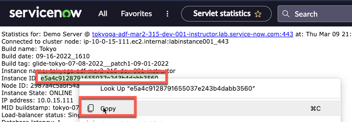
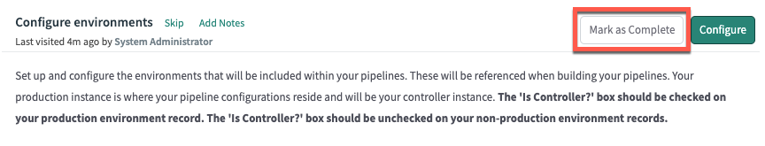

# Configure Environments in Prod 

{: .d-inline-block }
READY
{: .label .label-green }

{: .note}
> *At times in the lab, the term 'instance' and 'environment' are used interchangeably.  They both refer to a ServiceNow instance.*

Environment ```[sn_pipeline_environment]``` records contain information about a ServiceNow instance and how to access it. 

Together, they make up a Pipeline. You must first configure the Environment records before the Pipeline can be setup. 

Environment records do not sync across instances so creation is required on all instances (production and sub-production).

In this section, you will configure Environments for your Pipeline on your Prod instance. 

---

# Configure Dev Environment record 

{: .warning}
>This section is to be completed in your **production** instance where AEMC will be running.

{: .highlight}
> *You will be configuring the **DEV** environment record in your Prod instance.*

| 1) Click **All** | 
| 2) Type **pipelines**  
| 3) Click **Guided Setup** in the Pipelines and Deployments section 
| 4) Click the green **Get Started** button in the top-right. | 
| 5) Click **Get Started** in the **Configuring your production instance** section | 
| 6) Click **Configure** in the **Configure Environments** section  | 
| 7) Click **New** in the top right | 
| 8) Complete the form as below.  You **will not** be able to Submit until we get the Instance Id in the following steps. |  |

| Field | Value |
|:---|:---|
| Name | ```Dev``` |
| Instance Type| ```Development``` |
| Instance URL | ```The full URL of your Dev Lab instance (Ex. https://your-lab-123.service-now.com)``` |
| Instance credential | ```sn_deploy_pipeline.Pipeline_Credentials``` |
| Is Controller? | ```Leave unchecked``` |
| Instance Id | ```*See instructions below*``` |

{: .important}
*For the field "**Instance Id**", we will need to log in to the Dev Lab instance and manually retrieve this value.*

{: .warning}
***Switch to your Dev instance for these next few steps***

**On your Dev instance**

| 9) Click **All** 
| 10) Type ```stats.do``` |  
| 11) Hit Enter
| 12) Select and copy the value for *Instance ID* | 

{: .warning}
***Switch back to your Production instance***

| 13) Paste the *Instance ID* value into the *Instance ID* field and click **Validate**. | |

| 

| You should see a blue message that says "*The environment was validated successfully*". |

{: .warning}
> *If you see a red error message*
> 
>
> *Then you will need to do the following:*
> - Log in to Dev
> - Set the password for **pipeline_user**
> - Log in to Prod
> - Update the Credential records for **pipeline_user**
> - Attempt Validation again

| 14) Click **Submit** to finish creating the '*Dev*' environment record

***You have now created your Dev Environment record in your Prod instance.***

---

# Create the Prod Environment Record

| 15) Click **New** in the top right | 
| 16) Complete the form as below.  You **will not** be able to Submit until we get the Instance Id in the following steps. |  |

| Field | Value |
|:---|:---|
| Name | ```Prod``` |
| Instance Type| ```Production``` |
| Instance URL | ```The full URL of your Prod Lab instance (Ex. https://your-lab-123.service-now.com)``` |
| Instance credential | ```sn_deploy_pipeline.Pipeline_Credentials``` |
| Is Controller? | ```Leave unchecked``` |
| Instance Id | ```*See instructions below*``` |

{: .warning}
***Complete the next few steps in a new browser tab so you do not lose your place setting up the Prod environment record.***

**In your new browser tab**

| 17) Navigate to your **Prod** instance
| 18) Click **All** 
| 19) Type ```stats.do``` |  
| 20) Hit Enter
| 21) Select and copy the value for *Instance ID* | 

{: .warning}
***Switch back to your browser tab where Prod is open with Guided Setup and the Environment record***

| 22) Paste the *Instance ID* value into the *Instance ID* field and click **Validate**. | 

| 

| You should see a blue message that says "*The controller environment was validated successfully*". | 

{: .warning}
> *If you see a red error message*
> 
>
> *Then you will need to do the following:*
> - Open a new browser tab to Prod
> - Set the password for **pipeline_user**
> - Update the Credential records for **pipeline_user**
> - Attempt Validation again

| 23) Click **Submit** to finish creating the '*Prod*' environment record | 

***You have now created your Prod Environment record in your prod environment.***

| 24) Click the top-right 'X' to close the modal. | 

| 25) In the '*Configure environments*' section', Click '**Mark as Complete**' | 

That completes setup of your Environment record in the Prod environment.

Next up, you will configure the Pipeline in the Prod environment.

[Next][NEXT]{: .btn .btn-purple }

--- 
# Additional Notes

{: .note}
*For more information about Environments, see [[Product Documentation: Define environments]](https://docs.servicenow.com/csh?topicname=create-environment.html)*

[NEXT]: /lab_aemc/docs/configure-prod-pipeline