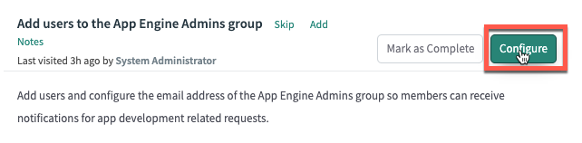

# Configure Pipeline
*Part of: Configuring your production instance*
{: .fs-4 .fw-300 }

{: .d-inline-block }
WORK IN PROGRESS
{: .label .label-yellow }

{: .d-inline-block }
5% complete
{: .label .label-red }

# Add users to the App Engine Studio Administrators group

{: .note}
*Configure App Engine Studio administrator group membership in the **production** instance to manage application intake and deployment requests.*

*Ensure the group membership in **production** is consistent with the App Engine Studio administrators identified in the **development** instance.*

*Group membership does not sync between environments and must be updated in both production and development.*

{: .warning}
If group membership is empty in the production instance, or if the Deployment Pipeline plugin is not installed, the system will refer to App Engine Studio Administrator group membership in the development instance.

{: .warning}
>This section is to be completed in your **production** instance where AEMC will be running.

| 1) In the '*Add users to the App Engine Admins group*' section, click **Configure** | 
| 2) In the 'Group Members' related list, click **Edit...**| 
| 3) Search for **Jayne Nigel**, move her to the right side of the list collector, and click **Save**. | 
| 4) Click 'X' to exit the modal. | 
| 5) In the '*Add users to the App Engine Admins group*' section, click **Complete** | 
| 6) Click '*Pipelines and Deployments Guided Setup*' at the top of the page |

Congratulations! Your Production instance is configure for App Engine!

Next, you will configure your non-production instances.  These are also sometimes referred to as Subproduction. 

[Previous][PREVIOUS]{: .btn .mr-4 }
<!-- [Next][NEXT]{: .btn .btn-purple }
-->

---
Additional Notes

{: .note}
> Go here!

[PREVIOUS]: /docs/configure-prod-pipeline
[NEXT]: /docs/configure-non-prod