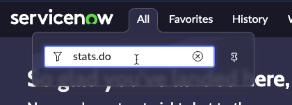

# Configure non-Prod

In each sub-production instance, set up and configure the Environment record which will point to the controller instance ([production] instance), where the Deployment Pipeline configurations reside.

All deployment requests are routed through the controller instance. Until this is configured, your developers will not be able to submit deployment requests.

# Environment setup

{: .warning}
> ***Each step below will need to be completed on each Subproduction in your Pipeline.***

| 1) Log in to the Subprod environment |
| 2) Click 'All', Type 'pipeline' | 
| 3) Click 'Guided Setup' | 
| 4) In the section '*Configuring your non-production instances*', click **Get Started** | 
| 5) In the section '*Configure the controller instance*', click **Configure** | 
| 6) Click **New** | 
| 7) Complete the form using the information below. | 

| Field | Value |
|:---|:---|
| Name | ```Prod``` |
| Instance Type| ```Production``` |
| Instance URL | ```The full URL of your Prod Lab instance (Ex. https://your-lab-123.service-now.com)``` |
| Instance credential | ```sn_deploy_pipeline.Pipeline_Credentials``` |
| Is Controller? | ```Leave unchecked``` |
| Instance Id | ```*See instructions link below on how to get stats.do page*``` |

{: .warning}
***Complete the next few steps in a new browser tab so you do not lose your place***

**In your new browser tab**

| 8) Navigate to your **Prod** instance
| 9) Click **All** 
| 10) Type ```stats.do``` |  
| 11) Hit Enter
| 12) Select and copy the value for *Instance ID* | 

{: .warning}
***Close this browser tab and switch back to your previous browser tab*** 

| 13) Paste the *Instance ID* value into the *Instance ID* field and click **Validate**. | 

| 

| You should see a blue message that says "*The controller environment was validated successfully*". | 

{: .warning}
> *If you see a red error message*
> 
>
> *Then you will need to do the following:*
> - Open a new browser tab to Prod
> - Set the password for **pipeline_user**
> - Update the Credential records for **pipeline_user**
> - Attempt Validation again

| 14) Click **Submit** to finish creating the '*Prod*' environment record | 

{: .highlight}
> If you get a message like below that says '*This is an invalid URL.*', click 'X' in the top right and close the modal. 
>
> That error can be safely ignored.

| **Example error**
| 

**Repeat the above content on this page on each sub-production instance that will be part of a pipeline**

{: .highlight}
> Follow the instructions below **ONLY** in your Test environment.

| 15) If this is **NOT** a Test environment, skip to **Step 19**. 

| 16) If this is a Test environment, click **Configure**. | 
| 17) Check both boxes and click **Save** | 

| 

**Enable ATF properties in your production instance if you plan to clone!**

| 18) Click the 'X' in the top right to close the modal. | 
| 19) Click **Mark as Complete** |  

{: .note}
Ensure that the controller instance was configured on all sub-production instances that are part of a pipeline!


 
[Previous][PREVIOUS]{: .btn .mr-4 }
<!-- [Next][NEXT]{: .btn .btn-purple }
-->

---
# Additional Notes 

{: .important}
Only users assigned the **admin** role can create and update Credential Alias records.

## Credential Alias

If a Credential Alias record for the controller (production) instance has not been created in each sub-production instance, you must create a Credential Alias record pointing to the controller instance in each sub-production instance.

{: .note-title}
## Cloning

If App Engine Studio is the only application using the Credentials table, consider creating data preservers for Credential Alias, Basic Auth, and Discovery credentials -- otherwise, ensure that these tables are not overwritten when the production instance is cloned down to sub-production instances.

App Engine Studio has data preservers on the following tables:
-   Pipeline Instance
-   Request Authorization Key
-   Deployment Request
-   Deployment Environment Request

To ensure application and developer data is not lost in development environments during a clone, add **data preservers** to the following:

-   Collaboration Descriptor tables:
-   App Collaboration Descriptors **[sys_appcollab_descriptor]**
-   App Collaboration Descriptor Permissions **[sys_appcollab_permission_m2m]**
-   Collaboration Users and Groups tables:
-   App Collaboration Users **[sys_appcollab_user]**
-   App Collaboration Groups **[sys_appcollab_group]**

Additionally, add **clone excludes** for the following Collaboration Descriptor tables. so that data in these tables are preserved after cloning and that no data from the source instance gets copied over. It is ok to have data merge from source and target for collaboration users and groups tables.

-   App Collaboration Descriptors **[sys_appcollab_descriptor]**
-   App Collaboration Descriptor Permissions **[sys_appcollab_permission_m2m]**

After cloning, a post-clone clean-up script is needed to reassign users and groups the appropriate delegated development permissions. We assume that in-development applications are backed up before cloning and users/groups are same between target and source instance.

***Note:** New App Engine Studio customers (Tokyo +) will only have data preservers on the tables listed above. Existing customers (pre-Tokyo) will also have data preservers on the following tables : Pipeline, Environment. Pipeline Environment Order, Pipeline Types*


[PREVIOUS]: /lab_aemc/docs/configure-prod-aes-admin
[NEXT]: /lab_aemc/docs/configure-prod-aes-admin