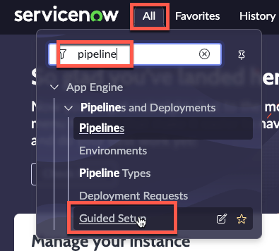
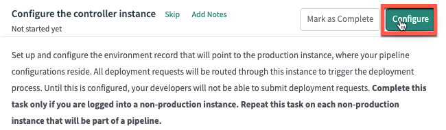
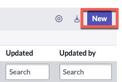
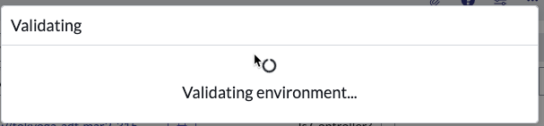

# Configure non-Prod

# Environment setup

{: .highlight}
> *Each step below will need to be completed on each Subproduction instance in your environment.*

| 1) Log in to the environment |
| 2) Click 'All', Type 'pipeline' | 
| 3) Click 'Guided Setup' | 
| 4) In the section '*Configuring your non-production instances*', click **Get Started** | 
| 5) In the section '*Configure the controller instance*', click **Configure** | 
| 6) Click **New** | 
| 7) Complete the form using the information below. | 

| Field | Value |
|:---|:---|
| Name | ```Prod``` |
| Instance Type| ```Production``` |
| Instance URL | ```The full URL of your Prod Lab instance (Ex. https://your-lab-123.service-now.com)``` |
| Instance credential | ```sn_deploy_pipeline.Pipeline_Credentials``` |
| Is Controller? | ```Leave unchecked``` |
| Instance Id | ```*See instructions link below on how to get stats.do page*``` |

{: .warning}
***Complete the next few steps in a new browser tab so you do not lose your place***

**In your new browser tab**

| 8) Navigate to your **Prod** instance
| 9) Click **All** 
| 10) Type ```stats.do``` |  
| 11) Hit Enter
| 12) Select and copy the value for *Instance ID* | 

{: .warning}
***Close this browser tab and switch back to your previous browser tab*** 

| 13) Paste the *Instance ID* value into the *Instance ID* field and click **Validate**. | 

| 

| You should see a blue message that says "*The controller environment was validated successfully*". | 

{: .warning}
> *If you see a red error message*
> 
>
> *Then you will need to do the following:*
> - Open a new browser tab to Prod
> - Set the password for **pipeline_user**
> - Update the Credential records for **pipeline_user**
> - Attempt Validation again

| 14) Click **Submit** to finish creating the '*Prod*' environment record | 

{: .highlight}
> If you get a message like below that says '*This is an invalid URL.*', click 'X' in the top right and close the modal. 
>
> That error can be safely ignored.

| 
