{: .d-inline-block }
# App Intake
{: .no_toc }
{: .d-inline-block }
PUBLISHED 2023/03/14
{: .label .label-green }

[Previous][PREV]{: .btn .mr-2 .fs-2}
[Next][NEXT]{: .btn .btn-purple .fs-2}

{: .warning}
>This section is to be completed in your **production** instance where AEMC is running.

{: .warning}
> | *Be sure your application scope is set to **Application Intake**. If it is not, use the application picker to change the current session's scope.*  | 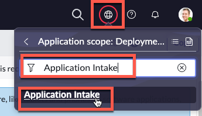

| 1) Click 'All' |
| 2) Type 'Applicatoin Intake' | 
| 3) Click 'Guided Setup' | 
| 4) Click **Get Started** | 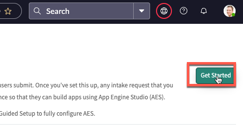
| 5) In the section **Turn on and configure the intake request**, click **Get Started** | 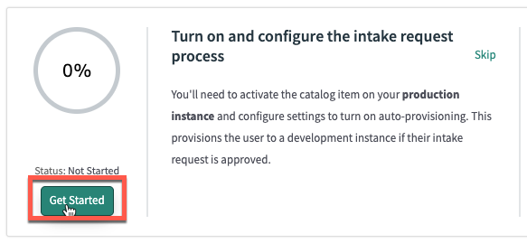
| 6) In the section **Activate the catalog item where...**, click **Configure**| 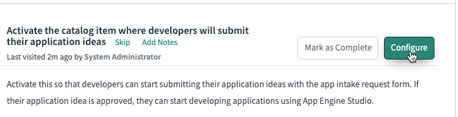

| This should open a new browser tab. | 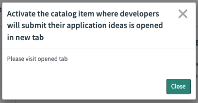
| 7) Switch to the new browser tab.

| 8) If you see '*...To edit this record click here*' link, please review the warning at top of page about scope. | 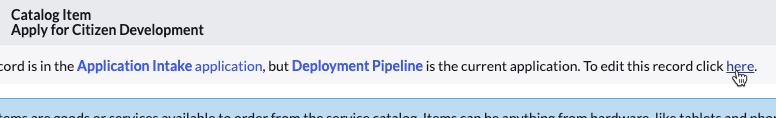
| 9) Validate that 'Active' is checked, then click **Update**. | 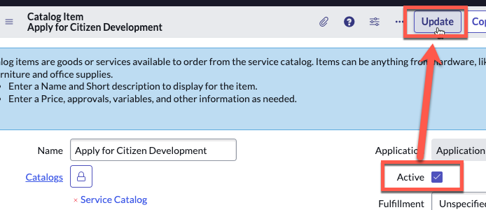
| 10) Close the browser tab and return to the previous one. 

| 11) In the section **Activate the catalog item where...** Click **Mark as Complete** | 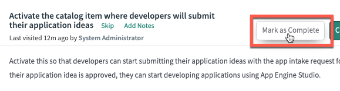

{: .highlight}
> Your organization may have it's own standards for Catalog Item activation as well as common questions and requirements.
>
> It is 100% acceptable and possible to create your own Catalog Item to onboard developers.

| 12) In the section **Set up App Engine Admins group**, click** **Mark as Complete** | 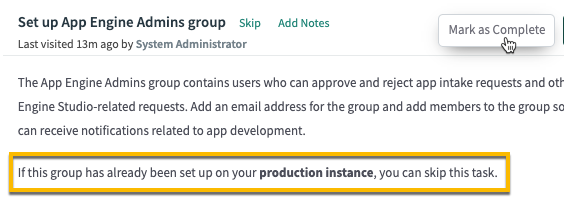  
| 13) In the section **Activate user provisioning**, click **Configure** | 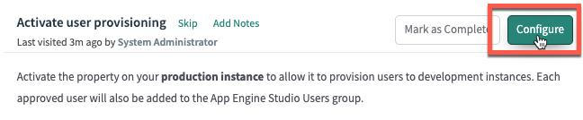
| 14) Make sure the 'Value' equals 'true' |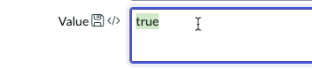
| 15) Click **Update** | 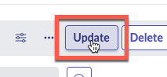
| 16) In the section **Activate user provisioning**, click **Mark as Complete** | 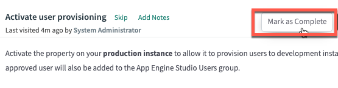

**Congratulations!!  At this point, you are ready to onboard developers and deploy their apps with ease!**

---

[Previous][PREV]{: .btn .mr-2 .fs-2}
[Next][NEXT]{: .btn .btn-purple .fs-2}

[PREV]: /lab_aemc/docs/configure-non-prod
[NEXT]: /lab_aemc/docs/onboarding