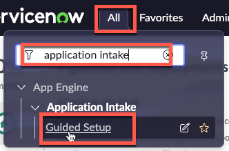

# Configure - App Intake
{: .no_toc }
{: .d-inline-block }
WORK IN PROGRESS
{: .label .label-yellow }

[Previous][PREV]{: .btn .mr-4 .fs-2}
[Next][NEXT]{: .btn .btn-purple .fs-2}

{: .warning}
>This section is to be completed in your **production** instance where AEMC is running.

| 1) Click 'All' |
| 2) Type 'Applicatoin Intake' | 
| 3) Click 'Guided Setup' | 
| 4) h | w

---

[Previous][PREV]{: .btn .mr-4 .fs-2}
[Next][NEXT]{: .btn .btn-purple .fs-2}

[PREV]: /lab_aemc/docs/configure-non-prod
[NEXT]: /lab_aemc/docs/faqs