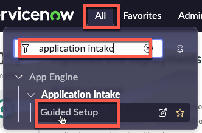

# Configure - App Intake
{: .no_toc }
{: .d-inline-block }
WORK IN PROGRESS
{: .label .label-yellow }

## Table of contents
{: .no_toc .text-delta }

1. TOC
{:toc}

| 1) Click 'All' |
| 2) Type 'Applicatoin Intake' | 
| 3) Click 'Guided Setup' | 
| 4) h | w

[Previous][PREVIOUS]{: .btn .mr-4 }

[PREVIOUS]: /lab_aemc/docs/configure-non-prod
[NEXT]: ../../lab_2_manage