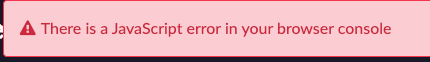

{: .d-inline-block }
# Onboard a developer
{: .no_toc }
{: .d-inline-block }
PUBLISHED 2023/03/14
{: .label .label-green }

[Previous][PREV]{: .btn .mr-2 .fs-2}
[Next][NEXT]{: .btn .btn-purple .fs-2}

| 1) In the top right, click the 'System Administrator' avatar | 
| 2) Click 'Impersonate User' 
| 3) Type 'Sydney Carter' and click 'Sydney Carter' in the search results | 
| 4) Click **Impersonate User** | 
| 5) Click 'All' | 
| 6) Type 'employee center'
| 7) Click 'Employee Center'
| 8) Click 'IT for IT' | 
| 9) Click 'Apply for Citizen Development' | 
| 10) Ignore the red error message or close it | 

{: .highlight}
> This message only appears for users logged in with the 'admin' role like we are today.
>
> Users without the 'admin' role will not see the error message. 

| 11) Fill out the form with the values below 

| Field | Value |
|:---|:---|
| Application Name | ```Request Time Off``` 
| Describe your idea | ```Allow users to request time off with approvals.```
| Is your process repeatable? | ```Yes```
| Do you have an email... ? | ```No```
| How many users... ? | ```>20```
| Does this involve... ? | ```No```
| Do you need data... ? | ```No```
| Who are the users... ? | ```Anyone in the IT Department```

| 12) Click **Submit**
| 13) After the request is submitted, close the browser tab and return to the original browser tab. 
| 14) Click the avatar in the top-right, then click 'Impersonate another user' | 
| 15) Type 'Jayne Nigel' and click 'Jayne Nigel' | 
| 16) Click **Impersonate user**

{: .important}
Jayne is our App Engine Admin that we configured earlier. She is not a Platform Administrator. She is responsible for managing requests from App Engine Users.

| 17) Click 'All'
| 18) Type 'app engine management'
| 19) Click 'App Engine Management Center' | 

{: .highlight}
This will open AEMC in a new browser tab.

| 20) In the 'Intake application requests' widget, click Sydney's request to open it. | 
| 21) In the top right, click 'Approve' | 

{: .note}
> The Prod instance will attempt to configure Sydney's App Engine User access on the Dev environment.

{:. highlight}
In the real world, there might be more than one person to do the approval and more time may be taken to review the answers.

| 22) Close the request tab in AEMC | 

**Congratulations! You have onboard Sydney to begin building her first app.  Jayne was able to do this just by clicking Approve on the request.**

---

[Previous][PREV]{: .btn .mr-4 .fs-2}
[Next][NEXT]{: .btn .btn-purple .fs-2}

[PREV]: /lab_aemc/docs/app-intake
[NEXT]: /lab_aemc/docs/faqs