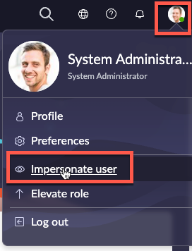
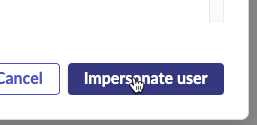
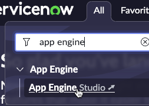
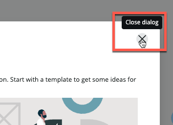
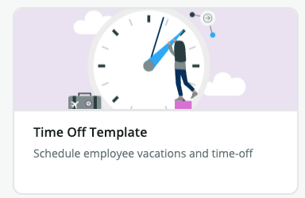
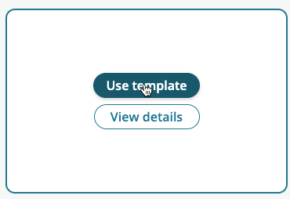
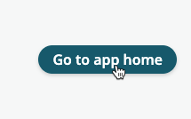
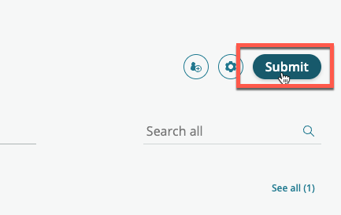
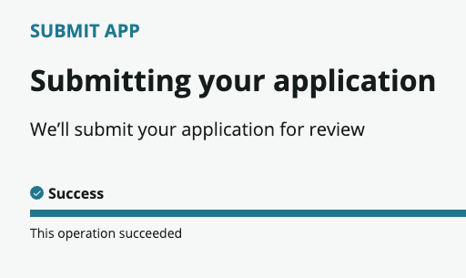

{: .d-inline-block }
# Build an app
{: .no_toc }
{: .d-inline-block }
PUBLISHED 2023/03/14
{: .label .label-green }

[Previous][PREV]{: .btn .mr-2 .fs-2}
[Next][NEXT]{: .btn .btn-purple .fs-2}

{: .warning}
>This section is to be completed in your **development** instance where development takes place.

| 1) Go to your **Dev** instance
| 2) Click the avatar in the top-right, then click 'Impersonate User' | 
| 3) Type 'Sydney Carter' and click 'Sydney Carter' in the search results | 
| 4) Click **Impersonate User** | 
| 5) Click 'All' | 
| 6) Type 'App Engine' 
| 7) Click on 'App Engine Studio' | 

{: .highlight}
This will open AES in a new browser tab

| 8) Close the 'Get Started' dialog. | 
| 9) At top of page, click 'TEMPLATES' | 
| 10) Move your mouse over 'Time Off Template' | 
| 11) Click 'Use template' | 
| 12) Enter the name 'IT Time Off Request'
| 13) Click **Continue**
| 14) Go take a five minute break while the app builds from the template.  | 
| 15) Click 'Go to app home' | 
| 16) Click **Submit** | 

{: .note}
> Feel free to look around App Engine Studio, but the main focus of this lab is deploying the app. 

| 17) Click **Submit** in the pop-up | 
| 18) Scroll down
| 19) In the field 'Release notes' type 'Created from template' | 
| 20) Click **Continue**

| 
| 

| 21) Click **Close** | 

| 

{: .note}
> Sydney can continue to edit her app, but she will not be able to Submit another version to deploy until the current deployment request is closed

**Congratulations! Your new developer has built and app and submitted a request to deploy it.**

---

[Previous][PREV]{: .btn .mr-2 .fs-2}
[Next][NEXT]{: .btn .btn-purple .fs-2}

[PREV]: /lab_aemc/docs/onboarding
[NEXT]: /lab_aemc/docs/faqs