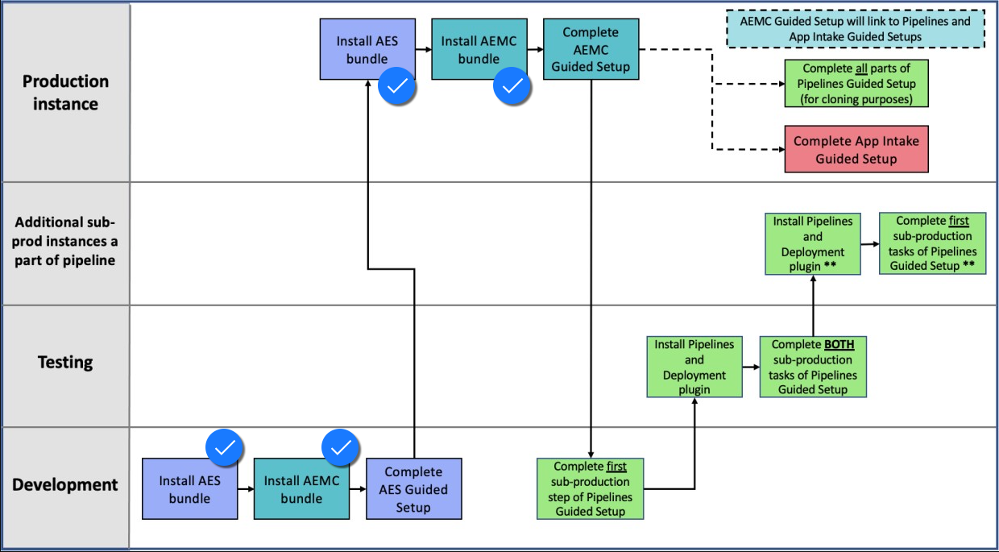

# Configuration Overview
{: .no_toc }

[Previous][PREVIOUS]{: .btn .mr-4 }
[Next][NEXT]{: .btn .btn-purple }

---
# Below is a basic diagram outlining the steps needed to complete to have a working App Engine Management Center.

{: .note}
The install steps in the diagram were completed for you as part of the Lab setup. 

[Previous][PREVIOUS]{: .btn .mr-4 }
[Next][NEXT]{: .btn .btn-purple }

[PREVIOUS]: ../
[NEXT]: ../120_App_Engine